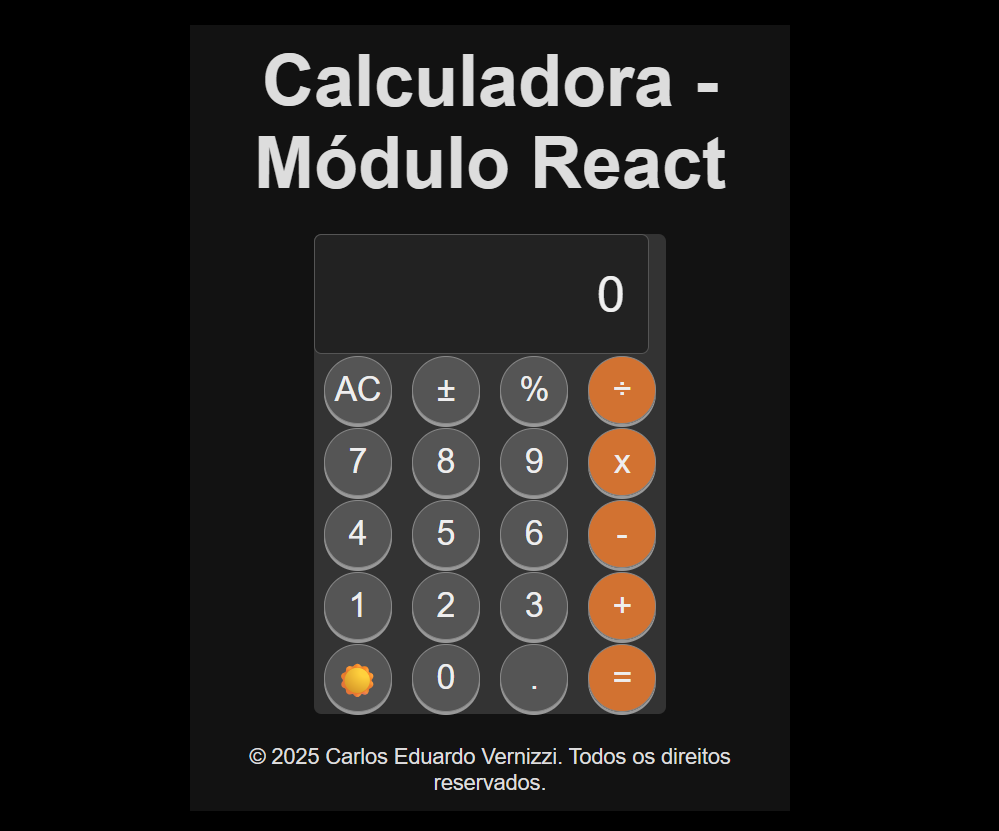

# Calculadora React

## Sobre

Projeto de uma calculadora feita com React e Vite, que inclui funcionalidades básicas como soma, subtração, multiplicação, divisão, porcentagem, inversão de sinal, além de um modo dark/light com responsividade para dispositivos móveis.

---

## Funcionalidades

- Operações básicas: +, -, ×, ÷
- Porcentagem (%)
- Inversão de sinal (±)
- Modo dark e light com troca via botão
- Layout responsivo com media queries
- Deploy feito com GitHub Pages

---

## Tecnologias utilizadas

- React
- Vite
- CSS Grid & Flexbox
- GitHub Pages para deploy

---
